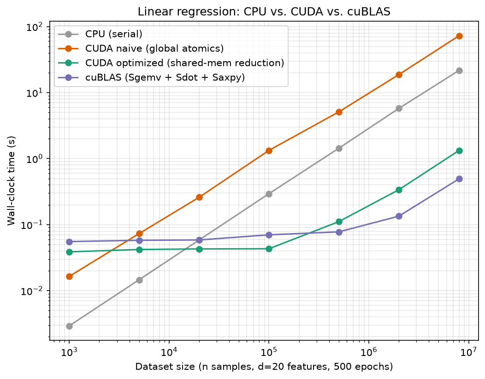

# Linear Regression: CPU vs. CUDA vs. cuBLAS

[](https://github.com/tasadilet-ctrl/linear-regression-cuda/actions/workflows/ci.yml)

Batch gradient descent for multiple linear regression, implemented four ways — CPU baseline, naive CUDA (global-memory atomics), optimized CUDA (shared-memory reduction), and cuBLAS — with two real crossover points measured, not assumed: where GPU starts winning over CPU, and where handwritten CUDA stops winning over cuBLAS.



Developed and benchmarked on an actual CUDA GPU (NVIDIA RTX PRO 6000 Blackwell, compute capability 12.0) via SSH to a remote box — every number below is a real measurement, not a projection. Hit and fixed a real bug along the way: an early draft dereferenced a device pointer from host code (`*d_b` outside a kernel) — illegal CUDA, caught before it was ever run, not after.

## Correctness first

All four implementations are checked against the *exact same* synthetic dataset (`y = X @ true_w + true_b + noise`, generated from a fixed seed) and compared on two things: final MSE, and max absolute error between the learned weights and the known ground-truth weights (not just "did the loss go down" — a model can have low loss without recovering the right coefficients). At every tested size from n=1,000 to n=8,000,000, **all four methods produce bit-identical MSE and weight-recovery error**. Same optimization trajectory, only the execution strategy differs — so any divergence would be a real bug (a race in the atomics, a wrong transpose flag in the cuBLAS calls, a lost sample in the block split).

"Bit-identical" means *across the four implementations built with one toolchain* — which is the claim that matters, since it isolates scheduling from arithmetic. The absolute values are toolchain-dependent: the same CPU baseline compiled with Apple clang instead of the g++ used on the benchmark box returns mse 0.24381480 rather than 0.24372667 at n=20,000, because the compilers contract and vectorize the reduction differently. If you rebuild elsewhere and see different digits, that's floating-point associativity, not a bug — which is why the correctness gates below compare against tolerances rather than hard-coded constants.

That's enforced by a script rather than left to the reader to eyeball:

```
$ python3 scripts/verify_agreement.py
  n=    1000  AGREE  mse=0.23874602 max_weight_err=0.02721381  [cpu, cublas, cuda_naive, cuda_optimized]
  n=  100000  AGREE  mse=0.24721767 max_weight_err=0.00386745  [cpu, cublas, cuda_naive, cuda_optimized]
  n= 8000000  AGREE  mse=0.25009486 max_weight_err=0.00030971  [cpu, cublas, cuda_naive, cuda_optimized]
  ...
All implementations agree exactly at all 7 dataset sizes.
```

### What the timings do and don't include

The reported times are **training compute only**; the one-time host-to-device copy of `X` and `y` is measured separately and reported alongside it (`transfer_time` in [`results.csv`](benchmarks/results.csv)). That's a deliberate choice — with 500 epochs the transfer is amortized — but it's measured rather than waved away: at the largest size, moving 672 MB costs 0.026s against 1.33s of compute for the optimized kernel (~2%) and 0.49s for cuBLAS (~5%). Including it would not move any crossover in this README.

## Finding 1: naive CUDA never wins

The naive kernel ([`linreg_cuda_naive.cu`](src/linreg_cuda_naive.cu)) assigns one thread per sample; every thread does `d` separate `atomicAdd`s directly into global memory to accumulate the gradient. That's `n × d` atomic operations contending on the same `d+1` memory locations, every single epoch. It loses to the single-threaded CPU baseline at *every* dataset size tested — including n=8,000,000, where it takes **72.6s against the CPU's 21.7s**, a 3.3x loss to a single core. Parallelism doesn't help if the synchronization overhead dominates the work.

## Finding 2: the fix, and where it stops being enough

[`linreg_cuda_optimized.cu`](src/linreg_cuda_optimized.cu) has each block accumulate its threads' contributions into **shared memory** first (still atomics, but low-latency and block-local), then issues just one global `atomicAdd` per block per feature — cutting global atomic traffic from O(n×d) to O((n/256)×d). Result: 31x faster than naive at n=100,000 (1.33s → 0.043s), and it now beats the single-threaded CPU by 6.8x even at this modest scale.

## Finding 3: our fused kernel beats cuBLAS... until it doesn't

[`linreg_cublas.cu`](src/linreg_cublas.cu) delegates the O(n×d) work to `cublasSgemv` (predictions and the weight gradient) and `cublasSdot` (bias gradient) — vendor-tuned BLAS, the same category of library that made `matmul-benchmark`'s naive loops look slow. But cuBLAS makes **5 separate GPU calls per epoch** (2× gemv, 1× custom residual kernel, 1× dot, 1× axpy) against the optimized kernel's **2** (gradient computation, then update). At small-to-medium sizes, that extra launch overhead costs more than BLAS's per-call efficiency saves:

| n | optimized (custom) | cuBLAS | winner |
|---|---|---|---|
| 1,000 | 0.039s | 0.055s | custom |
| 20,000 | 0.043s | 0.059s | custom |
| 100,000 | 0.043s | 0.070s | custom |
| 500,000 | 0.111s | 0.078s | cuBLAS (1.4x) |
| 2,000,000 | 0.338s | 0.135s | cuBLAS (2.5x) |
| 8,000,000 | 1.327s | 0.494s | cuBLAS (2.7x) |

The crossover lands between n=100,000 and n=500,000: below it, our fused two-launch kernel wins on overhead; above it, cuBLAS's actual matrix-vector throughput wins on scale. Neither "always write your own kernel" nor "always call the library" is the right takeaway — it depends on where the workload actually sits.

## Structure

```
src/
  linreg_common.h         # synthetic dataset generation, MSE, ground-truth weight check
  linreg_cpu.cpp          # CPU baseline
  linreg_cuda_naive.cu    # one thread/sample, global atomics
  linreg_cuda_optimized.cu# shared-memory block-level reduction
  linreg_cublas.cu        # cublasSgemv/Sdot/Saxpy
  test_cpu_correctness.cpp# GPU-free gate: gradient descent vs. closed-form OLS
scripts/
  benchmark.py            # all 4 methods across dataset sizes -> results.csv
  verify_agreement.py     # correctness gate: assert all 4 methods agree at every size
  plot_results.py         # the chart above
build.sh
benchmarks/                # CSV + chart from the runs used in this README
```

## Build & run

`build.sh` builds the CPU targets on any machine and adds the GPU ones when `nvcc` is present, so the mathematics can be verified without CUDA hardware:

```bash
./build.sh              # CPU targets always; CUDA targets too if nvcc is found
CPU_ONLY=1 ./build.sh   # skip the CUDA targets even when nvcc is available

bin/test_cpu_correctness   # gradient descent vs. closed-form OLS -- no GPU needed
```

The three GPU implementations need the CUDA toolkit to build and an actual NVIDIA GPU to run — neither exists on macOS (no CUDA on Apple Silicon or any Mac GPU). Benchmarked with CUDA 13.0 on an RTX PRO 6000 (compute capability 12.0 / Blackwell). CI compiles them with `nvcc` on a GPU-less runner, which catches compile-time regressions but cannot execute them.

```bash
CUDA_ARCH=native ./build.sh   # or CUDA_ARCH=sm_XX for your GPU's compute capability

bin/linreg_cpu             1000000 20 500 0.05 42
bin/linreg_cuda_naive      1000000 20 500 0.05 42
bin/linreg_cuda_optimized  1000000 20 500 0.05 42
bin/linreg_cublas          1000000 20 500 0.05 42

python3 scripts/benchmark.py
python3 scripts/verify_agreement.py   # correctness gate; exits nonzero on any divergence
python3 scripts/plot_results.py
```

## Possible extensions

- **Multiple GPUs**: this box has two RTX PRO 6000s — data-parallel sharding across both, with an all-reduce for the gradient, would be the natural next step.
- **cuSOLVER for the closed-form normal-equation solve** instead of gradient descent, as a fifth comparison point.
- **Mixed precision (TF32/FP16)** to see how much of the cuBLAS gap is precision-related vs. algorithmic.
